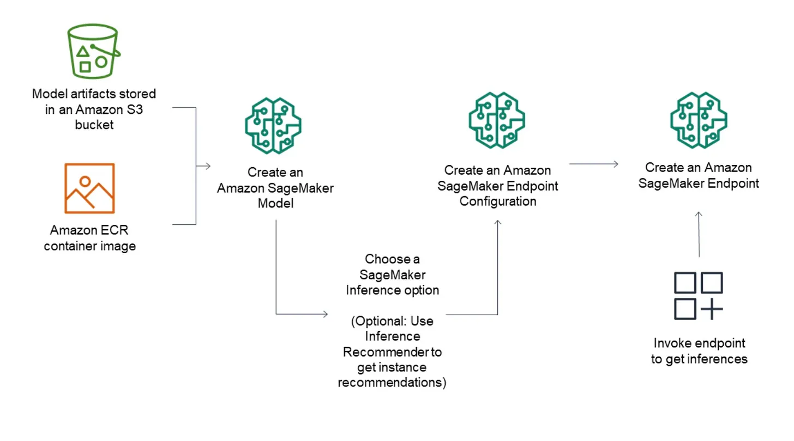

# Multi-replica endpoints deployment Mistral-7b-v0.1 with AWS Sagemaker

At this year's re:Invent (2023), a significant announcement for Amazon SageMaker involved the introduction of the Hardware Requirements object for Amazon SageMaker endpoints. 
This addition offers detailed control over the computing resources allocated for models on SageMaker, including specifications for minimum CPU, GPU, memory, and the number of replicas. 
This enhancement enables precise optimization of model throughput and cost efficiency by tailoring compute resources to fit the model's needs and supports the deployment of multiple Large Language Models (LLMs) on a single instance. 
Before this update, deploying multiple replicas of an LLM or several LLMs on a single endpoint was unfeasible, which could restrict the maximum throughput of models that are not compute-bound, such as deploying a single Mistral-7b model on g5.12xlarge instances.



**That being said, in this article, you will learn:**

- How to navigate the complexities of deploying Large Language Models (LLMs) using AWS SageMaker, including utilizing AWS SageMaker with Huggingface DLC, native AWS containers, and direct deployment on EC2 instances.
- To understand the deployment process deeply, from selecting the right LLM, creating an endpoint configuration and model, to finally creating an endpoint for your model within the AWS SageMaker ecosystem.
- The challenges and solutions for creating a production-ready environment in AWS SageMaker, including the new Hardware Requirements object for detailed control over computing resources.
- To grasp the essential components of SageMaker inference endpoints and how to effectively deploy models such as Mistral 7B, ensuring both high throughput and cost efficiency.
- Strategies for cleaning SageMaker resources thoroughly to avoid unexpected costs, ensuring all components of your deployment are successfully removed when no longer needed.

## Table of Contents

- [Articles](#articles)
- [Dependencies](#dependencies)
- [Install](#install)
- [Usage](#usage)
- [Resources](#resources)
- [License](#license)
- [Contributors](#contributors)

------

## Articles

To fully grasp the code, check out the full article

1. [Full Article](https://decodingml.substack.com/p/youre-not-digging-deeper-into-concepts)

## Dependencies

- [Python (version 3.11)](https://www.python.org/downloads/)
- [Poetry (version 1.6.1)](https://python-poetry.org/)
- [Docker (version 24.0.7)](https://www.docker.com/)


## Install

AWS: Install the aws-cli (don't use homebrew) and aws-vault (if you are in WSL, make sure you use the file vault).

aws-vault is a tool designed to securely manage AWS (Amazon Web Services) credentials and to facilitate the execution of commands that require AWS access. 
Check out their repository for how to install it : https://github.com/99designs/aws-vault

It's very important to use py-aws-vault-auth because the entire code use aws-vault for managing the AWS credentials.
It's very useful to use py-aws-vault-auth if you want to have an interactive shell fully authenticated with AWS credentials.
```shell
pip install -U git+https://github.com/achimgaedke/py-aws-vault-auth.git
```

As we use Poetry to manage the project, to install the project, you have to run the following:
```shell
poetry install
```

In order to run the code you must set up `.env` file, as follows:
```shell
cp .env.example .env
```

The `.env` file is splited into 2 categories:

1.Deployment Variables:
```shell
SM_NUM_GPUS=1  # Number of GPU used per replica
MAX_INPUT_LENGTH=4095 # Max length of input text
MAX_TOTAL_TOKENS=4096 # Max length of the generation (including input text)
MAX_BATCH_TOTAL_TOKENS=8192 # Limits the number of tokens that can be processed in parallel during the generation
HUGGING_FACE_HUB_TOKEN= "<REPLACE WITH YOUR TOKEN>" #It is used to acces the model from HuggingFace DLC
HF_MODEL_ID=mistralai/Mistral-7B-Instruct-v0.1 # model_id from hf.co/models
GPU_INSTANCE_TYPE='ml.g5.12xlarge'

```

2.Sagemaker Deployment Variables:
```shell
SAGEMAKER_ENDPOINT_SUMMARIZATION=llm-endpoint #name of sagemaker endpoint which will be used for inference
SAGEMAKER_MODEL_SUMMARIZATION=llm-model #name of sagemaker model
SAGEMAKER_ENDPOINT_CONFIG_SUMMARIZATION=llm-endpoint #name of endpoint configuration
SAGEMAKER_INFERENCE_COMPONENT_SUMMARIZATION=inference-component #name of inference component
ARN_ROLE='your sagemaker arn role' #This role must be configured from AWS interface

```

## Usage
In the script src/run.py is all the logic you need to deploy a LLM to the sagemaker environment.

The endpoint_type parameter is one of the most important parameters in this class. It can be:

    EndpointType.MODEL_BASED - without inference-components

    EndpointType.INFERENCE_COMPONENT - with inference-component

To be able to scale the SageMaker endpoint to handle thousands of requests it’s mandatory to have EndpointType.INFERENCE_COMPONENT.

In our model_resource_config we have copies=4, which means 4 replicas of our endpoint. If we check the cloud watch logs group ‘aws/sagemaker/InferenceComponents/your-inference-component-name, you should see 4 log streams, which represent the replicas.

The model_resource_config can be found in settings.py 
class Settings(ModelDeploySettings, SummarizationSettings):

    @property
    def model_resource_config(self):
        return ResourceRequirements(
            requests={
                "copies": self.COPIES,
                "num_accelerators": self.GPUS,
                "num_cpus": self.CPUS,
                "memory": 5 * 1024,  # Example value, adjust based on your needs
            },
        )


After you setup, the deployment of a model can be done using:
```shell
python src/run.py
```

To delete everything you can use:
```shell
python src/delete_sagemaker_resources.py
```

## Resources
AWS re:Invent 2023 - Scaling FM inference to hundreds of models with Amazon SageMaker (AIM327)
https://www.youtube.com/watch?v=6xENDvgnMCs&t=1245s 

AWS re:Invent 2023 - Scale complete ML development with Amazon SageMaker Studio (AIM325)
https://www.youtube.com/watch?v=stB-F6jswno

## License

This article is an open-source project released under the MIT license. Thus, as long you distribute our LICENSE and acknowledge our work, you can safely clone or fork this project and use it as a source of inspiration for whatever you want (e.g., work, university projects, college degree projects, etc.).

## Contributors

<table>
  <tr>
    <td><a href="https://github.com/alexandruvesa" target="_blank"></a></td>
    <td>
      <strong>Vesa Alexandru</strong><br />
      <i>Senior AI Engineer</i>
    </td>
  </tr>
</table>
